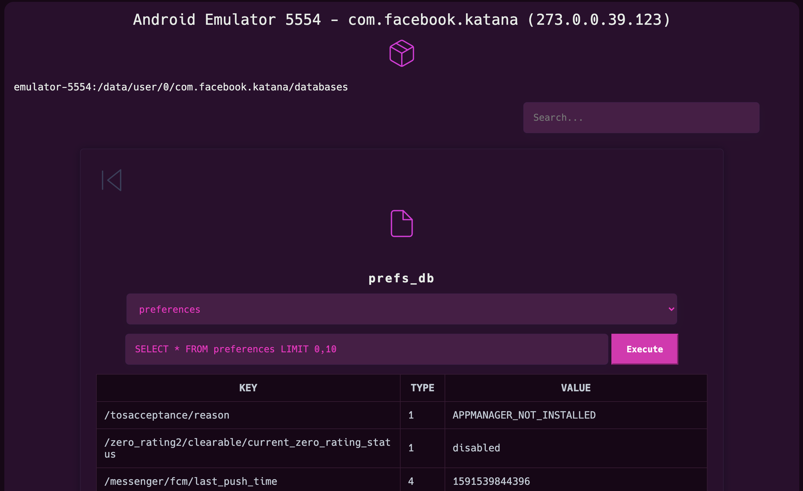

# Noia

[](https://badge.fury.io/js/noia)
[](https://opensource.org/licenses/MIT)

Noia is a web-based tool whose main aim is to ease the process of browsing an Android application sandbox and directly previewing SQLite databases, images, and more. Powered by [frida.re](https://www.frida.re).

Please note that I'm not a programmer, but I'm probably above the median in code-savyness. Try it out, open an issue if you find any problems. PRs are welcome.

## Installation & Usage

```shell
npm install -g noia
noia
```

### Features

* Explore third-party applications files and directories. Noia shows you details including the access permissions, file type and much more.

* View custom binary files. Directly preview SQLite databases, images, and more.

* Search application by name.

* Search files and directories by name.

* Navigate to a custom directory using the <kbd>ctrl+g</kbd> shortcut.

* Download the application files and directories for further analysis.

and more :sunglasses:



## Setup

### Desktop requirements:

* [node.js](https://nodejs.org/) **LTS** and [npm](https://www.npmjs.com)
* Any decent modern desktop browser

Noia is available on npm, so just type the following command to install it and run it:

```shell
npm install -g noia
noia
```

### Device setup:
Noia is powered by [frida.re](https://www.frida.re), thus requires Frida to run.

#### Rooted Device

See https://www.frida.re/docs/android/

#### Non-rooted Device

* https://koz.io/using-frida-on-android-without-root/
* https://github.com/sensepost/objection/wiki/Patching-Android-Applications

**Security Warning**

This tool is not secure and may include some security vulnerabilities so make sure to isolate the webpage from potential hackers.

## LICENCE

MIT